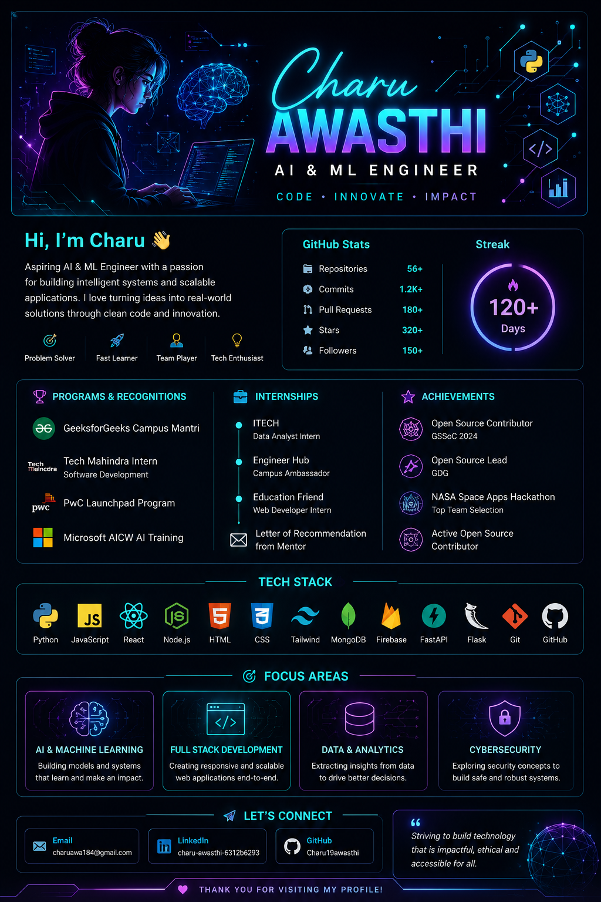

<h1 align="center">Charu Awasthi</h1>
<h3 align="center">AI & ML Engineer • Python Developer • Full Stack Developer</h3>

  

  

  
  

---

## About

I am an AI & ML focused developer with a strong foundation in Python and full stack development.
I build intelligent, scalable systems with clean architecture and real-world impact.

Currently exploring machine learning, backend engineering, and cloud technologies.

---

## Experience

### Programs

* 🎓 GeeksforGeeks Campus Mantri
* 💼 Tech Mahindra — Software Development Intern
* 🌐 PwC Launchpad Program
* 🤖 Microsoft AICW AI Training

### Internships

* 🏢 ITECH — Data Analyst Intern
* 🏢 Engineer Hub — Campus Ambassador
* 🏢 Education Friend — Web Developer

---

## Tech Stack

  

---

## Focus Areas

* ⚡ AI-based systems
* ⚡ Machine Learning applications
* ⚡ Scalable web platforms
* ⚡ Data-driven solutions

---

## Achievements

* 🏆 Open Source Contributor — GSSoC 2024
* ⭐ Open Source Lead — GDG
* 🚀 NASA Space Apps Hackathon — Top Team

---

## Connect

  
  

---

  

